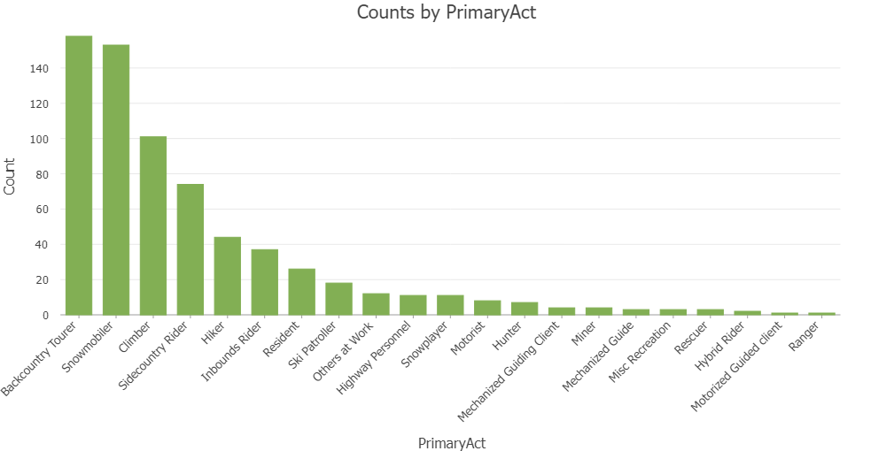

# Colorado County Avalanche Accidents (2020)

This project visualizes avalanche accidents in Colorado from 1951 to 2023, highlighting the counties affected by these incidents. Using interactive mapping techniques, the map allows users to explore the locations and details of each accident, including the primary parties involved, accident dates, and descriptions.

## Features

- **Map**: Displays avalanche accidents with clickable markers. Each marker shows details such as location, date, and primary involved groupe.
- **County Boundaries**: County boundaries are shaded based on the number of avalanche accidents, with a color ramp representing accident density.
- **Geolocation**: A button allows users to locate the viewers position on the map.
- **Legend**: Provides information on avalanche accident density by county and the primary activity involved in each incident (e.g., backcountry tourer, snowmobiler, climber, etc.).
- **Reset View**: A button to reset the map to its default view.

## Libraries and Data Sources
- [Leaflet](https://leafletjs.com/): JavaScript library for interactive maps.
- [Chroma.js](https://gka.github.io/chroma.js/): Color manipulation library for dynamic color scaling.
- [jQuery](https://jquery.com/): For DOM manipulation.
- [Leaflet-ajax](https://github.com/calvinmetcalf/leaflet-ajax): For loading GeoJSON data asynchronously.
- [Font Awesome](https://fontawesome.com/): For icon sets and toolkits.
- [Leaflet.locatecontrol](https://github.com/domoritz/leaflet-locatecontrol): Adds a geolocation control to Leaflet maps.

 <!-- space between the list -->

- **Avalanche Accidents**: Data from the [Colorado Avalanche Information Center](https://avalanche.state.co.us).

- **County Boundaries**: Data from the [Colorado Geospatial Portal](https://geodata.colorado.gov).

- **Map**: Base map tiles from TopPlus-Open-Grey provided by the [German Federal Agency for Cartography and Geodesy](http://www.govdata.de/dl-de/by-2-0).

The categories for the icons were determined based on the distribution of accidents within each category. This approach ensures that the visualization accurately reflects the prevalence of different types of avalanche accidents. The histogram below illustrates the distribution of accidents across these categories:

